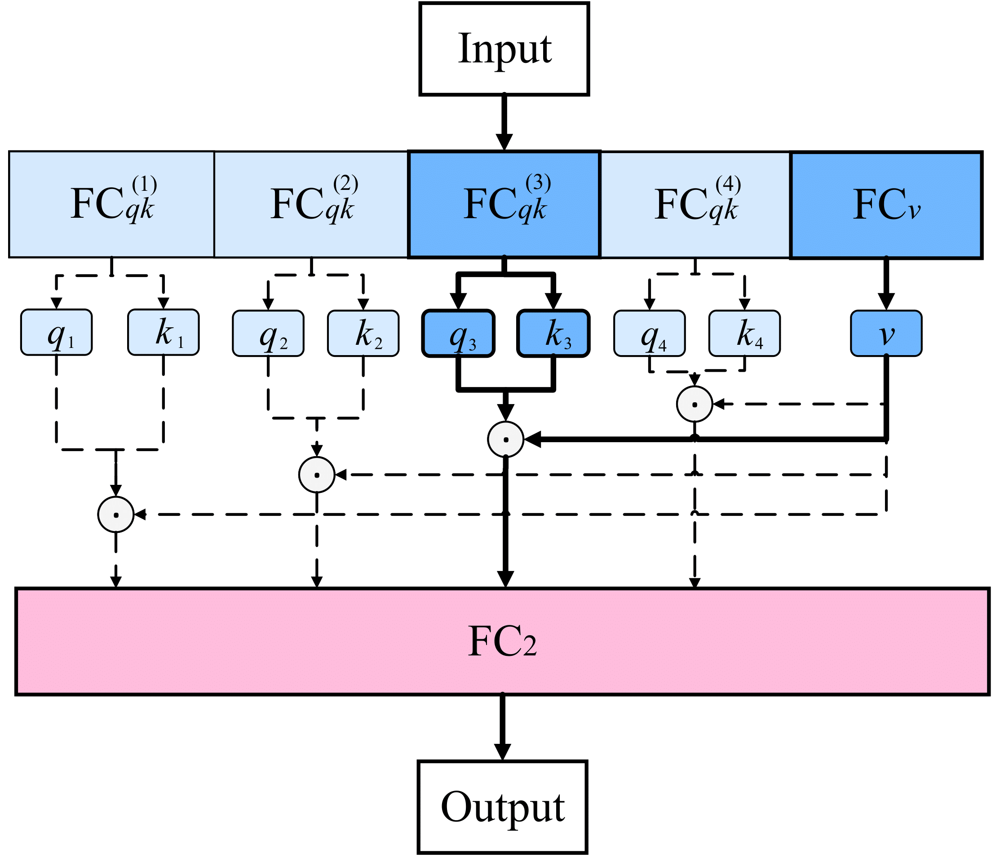

# Vision Transformer Architecture Search

This repository open source the code for [ViTAS: Vision Transformer Architecture Search](https://arxiv.org/pdf/2106.13700.pdf). ViTAS aims to search for pure transformer architectures, which do not include CNN convolution or indutive bias related operations.

## Requirements
1. torch>=1.4.0
1. torchvision
1. pymoo==0.3.0 for evaluation --> pip install pymoo==0.3.0 --user
1. change the 'data_dir' in yaml from search/retrain/inference directory to your ImageNet data path, note that each yaml have four 'data_dir' for training the supernet (train data), evolutionary sampling with supernet (val data), retraining the searched architecture (train data), and test the trained architecture (test data).
1. This code is based on slurm for distributed training.

## ViTAS

Illustration of the private class tokens and self-attention maps in the ViTAS. In the private
class tokens, for two different patch sizes p, we assign two independent
class tokens for each and obtain p patches and a private class token under one patch size setting. In
the private self-attention maps, value v is shared among the four cases with the four head numbers,
while q and k are obtained independently for all the cases.

 

## Reproducing

### To implement the search with ViTAS.

We incorporate 2 strategies in ViTAS for searching the optimal width, i.e., BCNet([paper](https://openaccess.thecvf.com/content/CVPR2021/papers/Su_BCNet_Searching_for_Network_Width_With_Bilaterally_Coupled_Network_CVPR_2021_paper.pdf)) and AutoSlim([paper](https://arxiv.org/pdf/1903.11728.pdf)).

We strongly recommend using BCNet mode since BCNet can promote the supernet being trained fairly and promote better-searched results. From the experiments of [BCNet](https://openaccess.thecvf.com/content/CVPR2021/papers/Su_BCNet_Searching_for_Network_Width_With_Bilaterally_Coupled_Network_CVPR_2021_paper.pdf), with the same searching budgets, BCNet can surpass AutoSlim by 0.8% on Top-1 accuracy.

```
chmod +x ./script/command.sh

chmod +x ./script/vit_1G_search.sh

./script/vit_1G_search.sh     (BCNet mode)

./script/vit_1G_search_AS.sh  (AutoSlim mode)
```

### To retrain our searched models.
For example, train our 1.3G architecture searched by ViTAS.
```
chmod +x ./script/command.sh

chmod +x ./script/vit_1.3G_retrain.sh

./script/vit_1.3G_retrain.sh
```

### To inference our searched results.

For example, inference our 1.3G architecture searched by ViTAS.
```
chmod +x ./script/command.sh

chmod +x ./script/vit_1.3G_inference.sh

./script/vit_1.3G_inference.sh
```

## Block-level searched results with ViTAS
Although the inspiring results from the ViTAS, the searched ViT architectures are complex and hard to remember for researchers. For the practicality of the ViTAS, we restricted all transformer blocks in a single architecture (i.e., a cell) to have the same structure, including head number and output dimension, with a steady patch size as 16. With this setting, the searched block-level optimal architecture is shown in the below table. With this setting, block-level architecture can achieve 74.7% on Top-1 accuracy on ImageNet.

Number | Type | Patch size / #Heads | Output Dim
:---: | :---: | :---: | :---: 
1 | Embedding | 16 | 230
12 | MHSA | 3 | 432
-- | MLP | - | 720


## Results of searched architectures with ViTAS
In each yaml, the 'save_path' in 'search' controls all paths (eg., line 34 in inference/ViTAS_1.3G_inference.yaml). The code will automatically build the path of 'save_path'+'search/checkpoint/' for your supernet, and also 'save_path' + 'retrain/checkpoint' for retraining the searched architecture.

Therefore, to inference the provided pth file, you need to build a path of 'save_path/retrain/checkpoint/download.pth' ('save_path' is specified in yaml and download.pth is provided in below table).

The extract code for Baidu Cloud is 'c7gn'.

Model name | FLOPs | Top 1 | Top 5 | Download
------------ | ------------- | ------------- | ------------- | -------------
ViTAS-A | 858M | 71.1% | 89.8% | [Google Drive](https://drive.google.com/drive/folders/15xGXCBXlmvQgFyw4qFHw2-Rx6M-5JS0U?usp=sharing), [Baidu Cloud](https://pan.baidu.com/s/1zl2c2AicGI60QaSpDwtusw)
ViTAS-B | 1.0G | 72.4% | 90.6% | [Google Drive](https://drive.google.com/drive/folders/1Hwt2rj4GWZsMLq8zCBMPX0TKe7-owWoU?usp=sharing), [Baidu Cloud](https://pan.baidu.com/s/1zl2c2AicGI60QaSpDwtusw)
ViTAS-C | 1.3G | 74.7% | 92.0% | [Google Drive](https://drive.google.com/drive/folders/151xZk-v6bLtZuzqxmoSagtehb2e5JpSM?usp=sharing), [Baidu Cloud](https://pan.baidu.com/s/1zl2c2AicGI60QaSpDwtusw)
ViTAS-E | 2.7G | 77.4% | 93.8% | [Google Drive](https://drive.google.com/drive/folders/1JwW5xTObaAosFsNZErkiND_rDnj6SEuG?usp=sharing), [Baidu Cloud](https://pan.baidu.com/s/1zl2c2AicGI60QaSpDwtusw)
ViTAS-F | 4.9G | 80.6% | 95.1% | [Google Drive](https://drive.google.com/drive/folders/11gpbIr4b7NJU14lIYvU5deRYHHeOFS1B?usp=sharing), [Baidu Cloud](https://pan.baidu.com/s/1zl2c2AicGI60QaSpDwtusw)

For a fair comparison of Deit and ViT architectures, we also provided their results in below table:

Model name | FLOPs | Top 1 | Top 5
------------ | ------------- | ------------- | -------------
DeiT-Ti | 1.3G | 72.2 | 80.1
DeiT-S | 4.6G | 79.8 | 85.7


## Citation

If you find that ViTAS interesting and help your research, please consider citing it:

```
@misc{su2021vision,
      title={Vision Transformer Architecture Search}, 
      author={Xiu Su and Shan You and Jiyang Xie and Mingkai Zheng and Fei Wang and Chen Qian and Changshui Zhang and Xiaogang Wang and Chang Xu},
      year={2021},
      eprint={2106.13700},
      archivePrefix={arXiv},
      primaryClass={cs.CV}
}

@misc{su2021bcnet,
      title={BCNet: Searching for Network Width with Bilaterally Coupled Network}, 
      author={Xiu Su and Shan You and Fei Wang and Chen Qian and Changshui Zhang and Chang Xu},
      year={2021},
      eprint={2105.10533},
      archivePrefix={arXiv},
      primaryClass={cs.CV}
}
```
